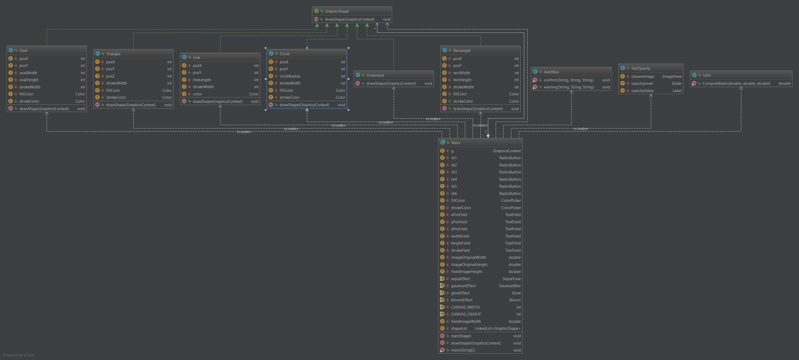
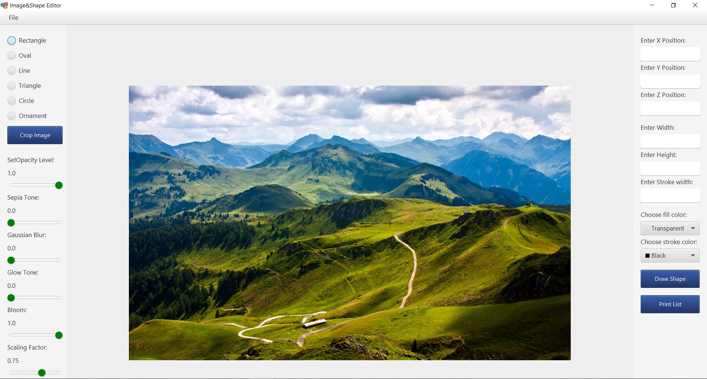
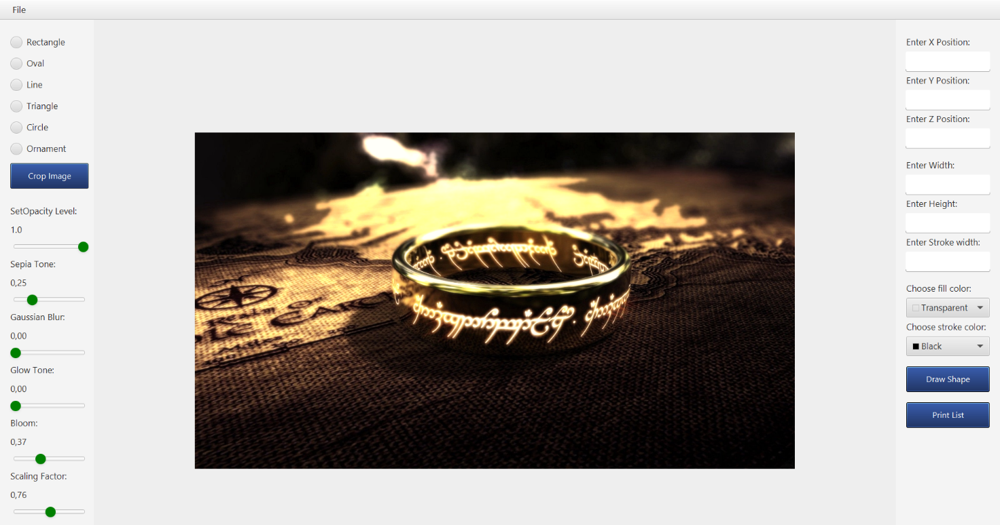

# Graphical & Image Editor

This project was developed as a laboratory work on Software Engineering, but later grew into a unique project that contains a primitive implementation of a graphics editor, that developed using JavaFX. In fact, there is a combination of two of my previous works - [Image Editor](https://github.com/JackShen1/imago) and [Graphical Editor](https://github.com/JackShen1/graphical-editor).

## Prerequisites

1. [IntelliJ IDEA](https://www.jetbrains.com/idea/download/#section=windows)
2. [Basic knowledge in Design Patterns](https://refactoring.guru/design-patterns)

## Functionality
The graphics editor contains the following features for drawing:

- [x] Rectangles
- [x] Triangles
- [x] Ovals
- [x] Circles
- [x] Lines
- [x] Ornaments

The image editor contains the following effects for working with images:

- [x] Sepia Tone
- [x] Gaussian Blur
- [x] Glow
- [x] Bloom

Other features include:

- [x] Line width selection
- [x] Opacity level
- [x] Scaling factor
- [x] Image crop
- [x] Canvas cleaning
- [x] Saving work results
- [x] Open images
- [x] Choice of color of a line of a figure
- [x] Choice of color of filling of a figure

**Note**: to draw a shape you need to press the `Draw shape` button.

In general, everything is based on the `Composite`, `Prototype` and `Visitor` patterns.

  
Class Diagram

    

## Example of project performance

    

    

    

